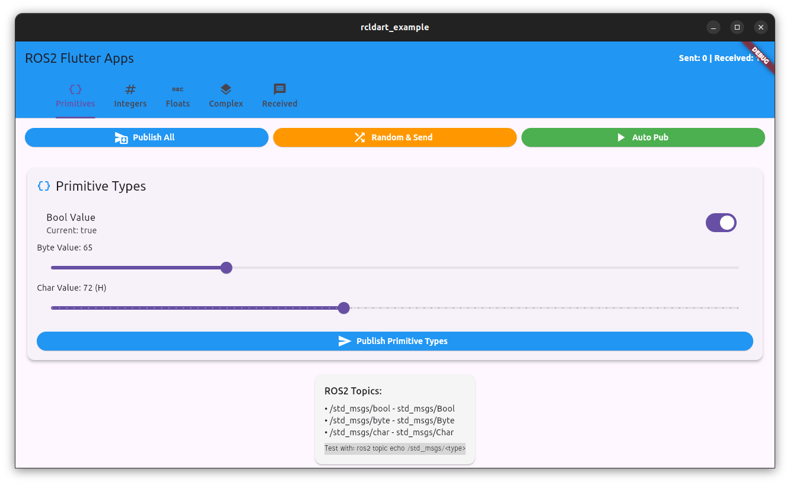
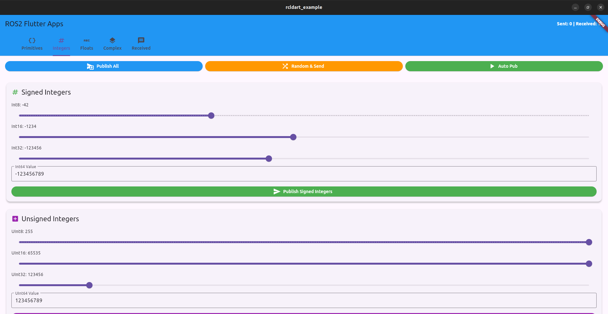
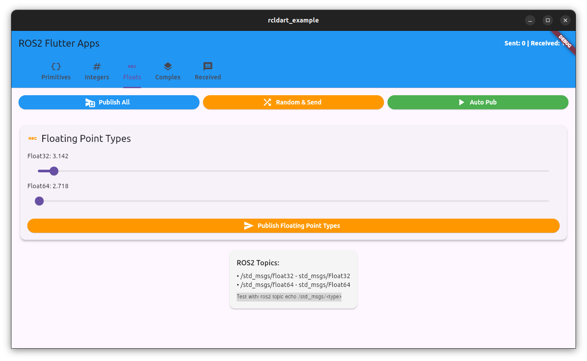
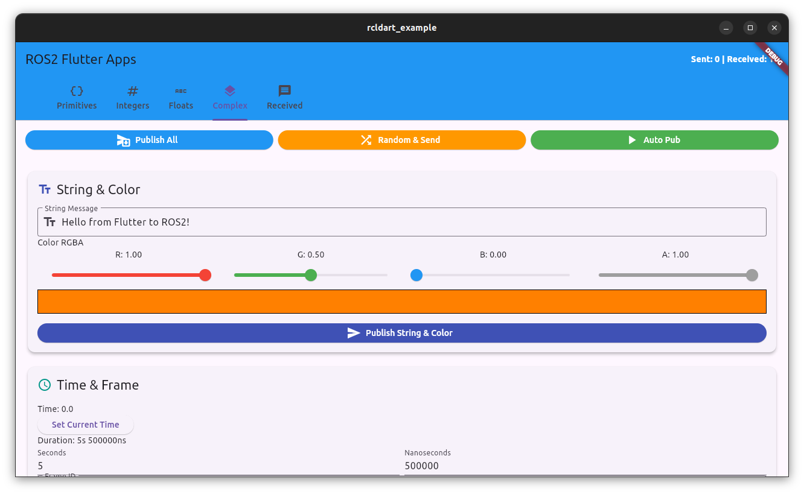
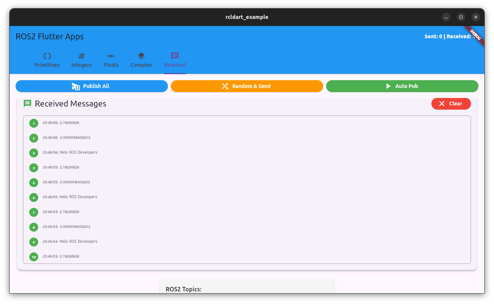

# rcldart

Flutter/Dart bindings for **ROS 2 Jazzy** — the current target distro. rcldart
wraps `rcl`/`rmw` over FFI, and the workspace adds a dependency-minimal path that
talks to a ROS 2 graph with no ROS install at all (see
[rcldart.github.io/rcldart](https://rcldart.github.io/rcldart/)).

## Getting Started

### Pritimitives


### Integers


### Floats


### Complex


### Received


```bash
ros2 topic pub /chatter std_msgs/String "data: Hello ROS Developers" 
```
```bash
ros2 topic pub /std_msgs/float32 std_msgs/Float32 "data: 3.14159" 
```

```bash
ros2 topic pub /std_msgs/float64 std_msgs/Float64 "data: 2.718281828"
```

logs:

```bash
flutter: 📊 Float32 message: 3.141590118408203
flutter: 📈 Float64 message: 2.718281828
flutter: 📦 Raw message data: Hello ROS Developers
flutter: 📊 Float32 message: 3.141590118408203
flutter: 📈 Float64 message: 2.718281828
flutter: 📦 Raw message data: Hello ROS Developers
flutter: 📊 Float32 message: 3.141590118408203
flutter: 📈 Float64 message: 2.718281828
flutter: 📦 Raw message data: Hello ROS Developers
flutter: 📊 Float32 message: 3.141590118408203
flutter: 📈 Float64 message: 2.718281828
flutter: 📦 Raw message data: Hello ROS Developers
flutter: 📊 Float32 message: 3.141590118408203
flutter: 📈 Float64 message: 2.718281828
```


## Supporting ROS 2

- [x] **Jazzy — current target.** The committed FFI bindings are generated against
      Jazzy; regenerate with `dart run ffigen --config ffigen_jazzy.yaml`.
- [~] Humble — original target; bindings must be regenerated to match a Humble
      runtime (a Jazzy runtime needs Jazzy-generated bindings, else struct ABI
      mismatch → crashes).
- [ ] Galactic (EOL)

> **Important:** the generated bindings (`lib/src/gen/…`) must be regenerated for
> the ROS 2 distro they run against. Running Humble-generated bindings on a Jazzy
> runtime (or vice-versa) corrupts memory on by-value struct calls (e.g.
> `rcl_subscription_get_default_options`) and segfaults.

## Supporting DDS

- [x] FastDDS

## Progress

- [x] Zero copy
- [x] Custom memory allocator
- [x] Topic (Pub/Sub)
- [x] Service (Client/Server)
- [x] Asynchronous programming (async/await) — `Client.call()` returns a `Future`
- [x] Executor — `wait_set` based (`rcl_wait`), replaces per-entity polling
- [x] Callback based programming
- [x] Logging
- [x] Signal handling
- [x] Parameter — Dart store + ROS `~/get_parameters`/`~/set_parameters`/… services (validate on device)
- [x] Timer
- [~] Action (service + topic) — model/API done; native `rcl_action` bindings pending

See [docs/services_parameters_actions.md](./docs/services_parameters_actions.md) for usage.